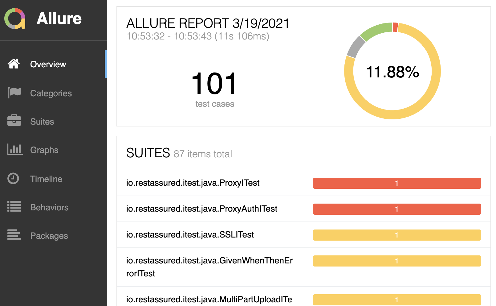

[](https://github.com/stornado/jurest/actions/workflows/github-publish.yml)

# JuRest

```bash
cp archetype-catalog.xml ~/.m2/repository/archetype-catalog.xml
cp aliyunmaven.xml ~/.m2/settings.xml
```

```bash
mvn archetype:generate \
    -DarchetypeGroupId=com.zxytech.jurest \
    -DarchetypeArtifactId=jurest-modules-archetype \
    -DartifactId=jurest-examples \
    -DgroupId=com.zxytech.jurest.examples
```

## Example

```bash
git clone --depth=1 https://github.com/stornado/jurest-examples.git
```

### PMD Check

check your case codes using PMD & CPD


### Cases Result

show your case results using Allure



## License

[Apache License](LICENSE)

## Based On

1. [Junit5](https://github.com/junit-team/junit5)
2. [Rest Assured](https://github.com/rest-assured)
3. [Allure](https://github.com/allure-framework)
4. [PMD](https://github.com/pmd)
